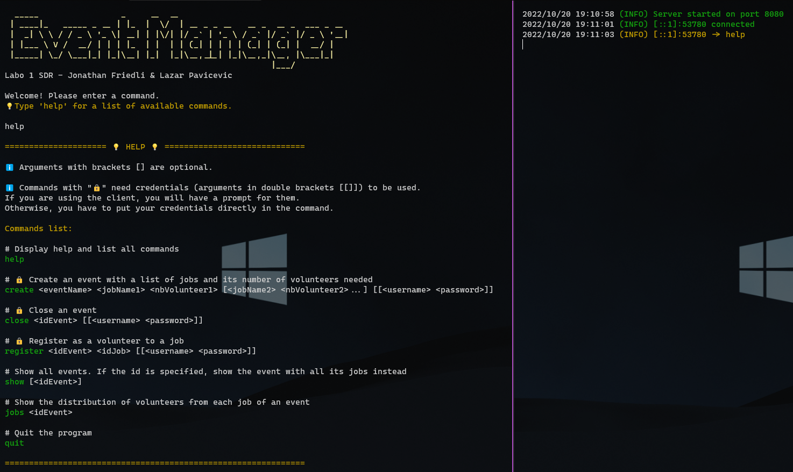

# Event Manager - Laboratoire 1 de SDR

[](https://github.com/Lazzzer/labo1-sdr/actions/workflows/tests.yml)



## Auteurs

Lazar Pavicevic et Jonathan Friedli

## Contexte

Ce projet est réalisé dans le cadre du cours de Systèmes Distribués et Répartis (SDR) de la HEIG-VD. Il a pour but de mettre en place un système de gestion de manifestation via une application client-serveur TCP-IP. Le créateur de la manifestation pourra créer différents jobs et les bénévoles pourront s'y inscrire.

## Utilisation du programme

L'application contient plusieurs flags qui permettent de choisir le lancement d'un serveur ou d'un client. Ils spécifient aussi si le serveur doit être lancé en mode `debug` et/ou en mode `silent`.

Le mode `debug` ralentit artificiellement d'un nombre paramétrable de secondes le serveur lorsqu'il rentre dans des sections critiques et affiche des messages d'entrées/sorties de ces dernières.

Le mode `silent` désactive les logs du serveur. Cependant, les logs du mode debug sont toujours affichés. Ceci est surtout pratique pour observer le comportement du serveur lor des tests d'intégration automatisés.

En cas de doute, une commande est disponible pour connaître les usages de l'application:

```bash
# A la racine du projet
go run . -h
# Ou
go run .\main.go --help

# Ou si le projet a été compilé et que l'exécutable se trouve dans le dossier courant
.\labo1-sdr.exe --help
```

Résultat:

```bash
Usage of labo1-sdr.exe:
  -debug
        Boolean: Run server in debug mode. Default is false
  -server
        Boolean: Run program in server mode. Default is client mode
  -silent
        Boolean: Run server in silent mode. Default is false
```

### Pour lancer un client:

```bash
# A la racine du projet
go run .\main.go
```

### Pour lancer un serveur:

```bash
# A la racine du projet
go run .\main.go --server

# En mode race & debug
go run -race .\main.go --server --debug

# En mode silent
go run .\main.go --server --silent
```

## Liste des commandes

```bash
# Afficher de l'aide
help
```

```bash
# Créer une manifestation avec une liste de noms de jobs et de bénévoles requis (Demande le nom d'utilisateur et le mot de passe de l'utilisateur)
create <eventName> <jobName1> <nbVolunteer1> [<jobName2> <nbVolunteer2>...] [[<username> <password>]]
```

```bash
# Clore une manifestation (Demande le nom d'utilisateur et le mot de passe de l'utilisateur)
close <idEvent> [[<username> <password>]]
```

```bash
# S'inscrire à une manifestation (Demande le nom d'utilisateur et le mot de passe de l'utilisateur)
register <idEvent> <idJob> [[<username> <password>]]
```

```bash
# Afficher toutes les manifestations ou une manifestation spécifique avec tous ses jobs
show [<idEvent>]
```

```bash
# Afficher la répartition des bénévoles d'une certaine manifestation
jobs <idEvent>
```

```bash
# Quitter le programme
quit
```

## Les tests

Les tests peuvent être lancés avec les commandes suivantes:

```bash
# A la racine du projet
go test -race .\client -v

# Si besoins, en vidant le cache
go clean -testcache && go test -race .\client -v
```

Notre fichier de test comporte un `TestClient` capable de recevoir un tableau de tests à effectuer. Il remplace les inputs utilisateurs par de simples strings et affiche à la console les résultats des tests.

La fonction `init()` est lancée avant la batterie de tests et permet de mettre en route deux serveurs de tests sur les ports `8081` et `8082`.

Le premier serveur sert aux tests d'intégrations qui vérifient principalement une implémentation correcte des commandes. Le second serveur est en mode `debug` et sert à vérifier le bon comportement du code lors d'accès concurrents aux sections critiques.

Une [Github Action](https://github.com/Lazzzer/labo1-sdr/actions/workflows/tests.yml) lance automatiquement les tests sur trois versions de l'application compilées pour Windows, MacOS et Linux.


## Procédure de tests manuels sur les accès concurrents

### Mise en place:

A la racine du projet, se trouve le fichier `config.json` pour spécifier l'adresse, le port et surtout le temps de délai artificiel lors des accès concurrents. Nous pouvons laisser la plupart des valeurs telles quelles. Il faut juste s'assurer d'avoir un nombre suffisamment grand (ex. 10s) pour la propriété `debug_delay`.

Il nous faut lancer :

- un serveur en mode `debug` (soit via le flag `--debug`, soit avec la propriété dans le fichier `config.json`).
- deux clients

### Test de deux clients souhaitant s'inscrire à la dernière place d'un même job

Client 1 :

```bash
#1
register 3 3
#2
Enter username: jonathan
#3 A insérer simultanément
Enter password: root
```

Client 2 :

```bash
#1
register 3 3
#2
Enter username: valentin
#3 A insérer simultanément
Enter password: root
```

Résultat si c'est le client 1 qui est le premier à insérer le mot de passe:


Nous voyons bien qu'il n'y a plus de places pour le client 2 (valentin) qui s'essuie donc un refus.

### Test d'un client qui crée une manifestation et un autre client qui s'inscrit à cette manifestation :

Client 1 :

```bash
#1
create hellFest sécurité 10 montage 50 musicien 30
#2
Enter username: jonathan
#3 A insérer simultanément
Enter password: root
```

Client 2 :

```bash
#1
register 4 1
#2
Enter username: valentin
#3 A insérer simultanément
Enter password: root
```

Résultat si c'est le client 1 qui est le premier à insérer le mot de passe:


Ici, le client 2 a réussi à s'inscrire à une manifestation qui n'existait pas au moment de la requête. Sauf, que vu que le client 1 a créé la manifestation et a eu accès à la section partagée avant lui, il a pu s'y inscrire car il a du attendre l'accès à la section critique.

## Implémentation et spécificités

Nous avons choisi une implémentation où le client et le serveur s'échangent des strings via `io.Copy` une fois leur connexion établie. Le client envoie les commandes complètes en inline et le serveur répond avec un message formaté rendant soit le résultat de l'opération voulue, soit une erreur spécifique.

### Le serveur

Le serveur est capable de gérer plusieurs connexions de clients en lançant des goroutines pour chacune d'entre elles. Il s'appuie sur le contenu du fichier `entities.json` pour générer les entités de base (manifestations, jobs, bénévoles) à son lancement. Nous utilisons le principe du CSP (Communicating sequential processes) pour synchroniser les différentes goroutines qui peuvent accéder à la même ressource en concurrence. Pour cela, le serveur se repose fortement sur deux canaux: un pour les manifestations et un autre pour les utilisateurs.

### Le client

Le client est relativement simple mais comporte cependant certains avantages le rendant plus intéressant qu'un bête client "netcat". Il peut détecter si une commande insérée existe et évite notamment de spammer le serveur avec des messages inutiles ou vides. Une fois qu'une commande passe son filtre, c'est au serveur de s'assurer de la conformité des arguments avant de poursuivre le traitement. Le client sait aussi détecter quelle commande demande une authentification et propose donc un prompt d'authentification comme étape intermédiaire avant d'envoyer la commande au serveur. Bien entendu, le mot de passe n'est pas affiché pendant la saisie. Finalement, le client écoute aussi les signaux du `CTRL+C` et émet une commande `quit` classique avant de clore proprement la connexion et se terminer.

### Les couleurs et les emojis

Nous utilisons des couleurs (qui sont simplement des caractères spéciaux que nous avons déclarés dans le fichiers `colors.go`) et des emojis pour rendre l'expérience utilisateur plus agréable. Ces ajouts esthétiques peuvent ne pas s'afficher correctement, notamment sur des consoles comme `cmd`.

Nous nous sommes principalement assurés que l'application s'affichait bien sur la console `Windows Terminal` (devenu depuis peu la console par défaut de Windows 11) en lançant des shells `zsh` (avec WSL2) et `Powershell`.

### Ce qui ne marche pas bien

De manière globale, l'application fonctionne relativement bien. Nous n'avons pas à signaler de dysfonctionnements majeurs sur les fonctionnalités demandées par le cahier des charges. Cependant, nous avons remarqué quelques problèmes mineurs:

- Les logs du serveur pour des actions simultanées peuvent s'afficher dans un ordre légèrement différent de la réalité si l'affichage se fait vraiment en même temps. Nous pouvons l'observer sur les tests d'accès concurrents. Du coup, pour les logs datés à la même seconde, cela peut faire penser que nous accédons à une section critique en même temps alors que ce n'est pas le cas.

- Il n'est pas possible d'insérer des noms avec des espaces. Ici, nous avons fait le choix de privilégier la simplicité d'implémentation et de nous concentrer sur les fonctionnalités demandées. Nous aurions pu utiliser des guillemets et faire un traitement plus poussé des arguments.

```

```
