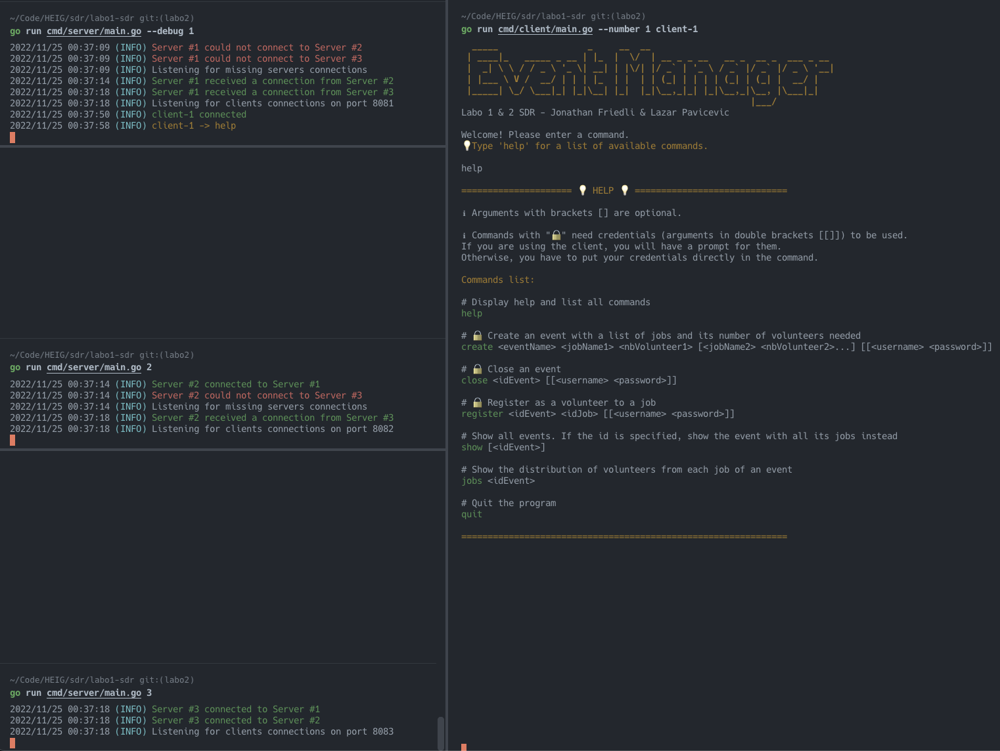

# Event Manager - Laboratoire 1 & 2 de SDR

[](https://github.com/Lazzzer/labo1-sdr/actions/workflows/tests.yml)



## Auteurs

Lazar Pavicevic et Jonathan Friedli

## Contexte

Ce projet est réalisé dans le cadre du cours de Systèmes Distribués et Répartis (SDR) de la HEIG-VD.

Le laboratoire n°1 a pour but de mettre en place un système de gestion de manifestation via une application client-serveur TCP-IP. Le créateur de la manifestation pourra créer différents jobs et les bénévoles pourront s'y inscrire.

Le laboratoire n°2 ajoute un réseau de serveurs synchronisant leurs données locales avec un mécanisme d'exclusion mutuelle distribuée avec l'algorithme de Lamport optimisé.

## Utilisation du programme

L'application contient deux exécutables : un pour le serveur et un pour le client.

Le serveur peut être lancé en mode `debug` et/ou en mode `silent`.

Le mode `debug` ralentit artificiellement d'un nombre paramétrable de secondes le serveur lorsqu'il rentre dans des sections critiques et affiche des messages d'entrées/sorties de ces dernières.

Le mode `silent` désactive les logs du serveur. Ceci est surtout pratique pour observer le comportement du serveur lor des tests d'intégration automatisés.

### Pour lancer un serveur:

Le serveur a besoin d'un entier en argument qui représente la clé des maps présentes dans son fichier de configuration. Ces maps indiquent le port d'écoute pour les clients et l'adresse de tout les autres serveurs composant le réseau.

Il dispose de deux flags `--debug` et `--silent` qui peuvent être utilisés pour activer les modes `debug` et `silent` respectivement.

```bash
# A la racine du projet

# Lancement du serveur n°1
go run cmd/server/main.go 1

# Lancement du serveur n°1 en mode race & debug
go run -race cmd/server/main.go --debug 1

# Lancement du serveur n°1 en mode silent
go run cmd/server/main.go --silent 1
```

### Pour lancer un client:

Le client a besoin d'un entier en argument qui l'identifie au près du serveur. Il peut aussi prendre un flag `--number` pour spécifier le numéro du serveur auquel il se connecte. Si ce flag n'est pas spécifié, le client choisit au hasard un serveur présent dans son fichier de configuration.

```bash
# A la racine du projet

# Connexion au serveur numéro 1 avec le nom de client "client-42"
go run cmd/client/main.go --number 1 client-42

# Connexion à un serveur aléatoire avec le nom de client "client-random" (en mode race)
go run -race cmd/client/main.go client-random
```

### Usages:

```bash
# A la racine du projet
go run cmd/server/main.go --help
go run cmd/client/main.go --help

# Ou si le projet a été compilé et que l'exécutable se trouve dans le dossier courant
.\main.exe --help # Sous Windows
./main --help # Sous Linux/macOS
```

Résultat pour le serveur:

```bash
Usage of ./main:
  -debug
    	Boolean: Run server in debug mode. Default is false
  -silent
    	Boolean: Run server in silent mode. Default is false
```

Résultat pour le client:

```bash
Usage of ./main:
  -number int
    	Integer: Number of the server to connect to, Default is -1 (default -1)
```

## Liste des commandes

```bash
# Afficher de l'aide
help
```

```bash
# Créer une manifestation avec une liste de noms de jobs et de bénévoles requis (Demande le nom d'utilisateur et le mot de passe de l'utilisateur)
create <eventName> <jobName1> <nbVolunteer1> [<jobName2> <nbVolunteer2>...] [[<username> <password>]]
```

```bash
# Clore une manifestation (Demande le nom d'utilisateur et le mot de passe de l'utilisateur)
close <idEvent> [[<username> <password>]]
```

```bash
# S'inscrire à une manifestation (Demande le nom d'utilisateur et le mot de passe de l'utilisateur)
register <idEvent> <idJob> [[<username> <password>]]
```

```bash
# Afficher toutes les manifestations ou une manifestation spécifique avec tous ses jobs
show [<idEvent>]
```

```bash
# Afficher la répartition des bénévoles d'une certaine manifestation
jobs <idEvent>
```

```bash
# Quitter le programme
quit
```

## Les tests

Les tests peuvent être lancés avec les commandes suivantes:

```bash
# A la racine du projet
go test -race ./test/. -v

# Si besoins, en vidant le cache
go clean -testcache && go test -race ./test/. -v
```

Notre fichier de test comporte un `TestClient` capable de recevoir un tableau de tests à effectuer. Il remplace les inputs utilisateurs par de simples strings et affiche à la console les résultats des tests.

La fonction `init()` est lancée avant la batterie de tests et permet de mettre en route un serveur de test sur le ports `8091`.

Le serveur sert aux tests d'intégrations qui vérifient principalement une implémentation correcte des commandes.


Une [Github Action](https://github.com/Lazzzer/labo1-sdr/actions/workflows/tests.yml) lance automatiquement les tests sur trois versions de l'application compilées pour Windows, MacOS et Linux.


## Procédure de tests manuels sur les accès à la section critique locale

### Mise en place:

#### Initialisation:

Pour cette partie, nous n'avons réellement besoin que d'un seul serveur.
Cependant, vu que nous avons un réseau de serveurs, nous devons aussi lancer les autres serveurs même s'ils ne participent pas au test de la section critique locale.

Une alternative possible est de modifier le fichier `config.json` de l'exécutable du serveur pour n'avoir qu'un serveur dans la liste.

Voici comment les lancer :

```bash
cd cmd/server

#Lancement en mode debug
go run main.go -debug 1

#Lancement des autres serveurs
go run main.go 2
go run main.go 3
```

Ensuite, nous lançons deux client :

Lancement de client-1 :

```bash
cd cmd/client
go run main.go --number 1 client-1
```

Lancement de client-2 :

```bash
cd cmd/client
go run main.go --number 1 client-2
```

### Test de deux clients souhaitant s'inscrire à la dernière place d'un même job

client-1 :

```bash
#1
register 3 3
#2
Enter username: jonathan
#3 A insérer simultanément
Enter password: root
```

client-2 :

```bash
#1
register 3 3
#2
Enter username: valentin
#3 A insérer simultanément
Enter password: root
```

Résultat si c'est `client-1` qui est le premier à insérer le mot de passe:


Nous voyons bien qu'il n'y a plus de places pour `client-2` (valentin) qui s'essuie donc un refus.

### Test d'un client qui crée une manifestation et un autre client qui s'inscrit à cette manifestation :

client-1 :

```bash
#1
create hellFest sécurité 10 montage 50 musicien 30
#2
Enter username: jonathan
#3
Enter password: root
```

client-2 :

```bash
#1
register 4 1
#2
Enter username: valentin
#3
Enter password: root
```

Résultat si c'est `client-1` qui est le premier à insérer le mot de passe:


Ici, `client-2` a réussi à s'inscrire à une manifestation qui n'existait pas au moment de la requête. Sauf que vu que `client-1` a créé la manifestation et a eu accès à la section partagée avant lui, il a pu s'y inscrire, car il a du attendre l'accès à la section critique.

## Procédure de tests manuels sur les accès à la section critique distribuée

### Test d'un client faisant une requête et le serveur fait une demande d'accès à la section critique partagée.

#### Initialisation:

Lancer le serveur 1 depuis la racine du projet:

```bash
cd cmd\server
go run .\main.go -debug 1
```

Lancer le serveur 2 depuis la racine du projet:

```bash
cd cmd\server
go run .\main.go -debug 2
```

Lancer le serveur 3 depuis la racine du projet:

```bash
cd cmd\server
go run .\main.go -debug 3
```

Lancer client-1 sur le serveur 1 depuis la racine du projet:

```bash
cd cmd\client
go run .\main.go -number 1 client-1
```

client-1 connecté au serveur 1 :

```bash
#1
close 2
#2
Enter username: john
#3
Enter password: root
```

Voici le résultat de la manipulation:


On voit que le serveur fait une demande d'accès à la section critique partagée et attend d'avoir reçu tous les `Ack` avant d'y entrer. Il y accède et une fois qu'il a terminé, il émet un `Rel`.

### Test d'un client faisant une requête sur un serveur et un autre client fait une autre requête sur un autre serveur.

#### Initialisation:

Lancer le serveur 1 depuis la racine du projet:

```bash
cd cmd\server
go run .\main.go -debug 1
```

Lancer le serveur 2 depuis la racine du projet:

```bash
cd cmd\server
go run .\main.go -debug 2
```

Lancer le serveur 3 depuis la racine du projet:

```bash
cd cmd\server
go run .\main.go -debug 3
```

Tous les serveurs sont lancés en mode debug.

Lancer client-1 sur le serveur 1 depuis la racine du projet:

```bash
cd cmd\client
go run .\main.go -number 1 client-1
```

Lancer client-2 sur le serveur 3 depuis la racine du projet:

```bash
cd cmd\client
go run .\main.go -number 3 client-2
```

client-1 :

```bash
#1
close 2
#2
Enter username: john
#3
Enter password: root
```

Juste après, client-2 :

```bash
#1
register 2 1
#2
Enter username: claude
#3
Enter password: root
```

Voici le résultat de la manipulation:


Ici, on voit que le serveur 1 a émis une demande d'accès à la section critique partagée et attend d'avoir reçu tous les `Ack` avant d'y entrer. Il y accède et une fois qu'il a terminé, il émet un `Rel`.

Le serveur 3 a reçu un `Req` et a donc émis un `Ack` au serveur 1. Ensuite il a émis un `Req` mais il doit attendre la libération de la section critique partagée par le serveur 1. Lorsqu'il reçoit le `Rel`, il accède à la section critique et émet un `Rel` quand il a fini avec la section critique.

### Test d'un client faisent une écriture sur un serveur en mode debug et un autre client fait une lecture sur un serveur en mode normal.

#### Initialisation:

Lancer le serveur 1 depuis la racine du projet:

```bash
cd cmd\server
go run .\main.go -debug 1
```

Lancer le serveur 2 depuis la racine du projet:

```bash
cd cmd\server
go run .\main.go -debug 2
```

Lancer le serveur 3 depuis la racine du projet:

```bash
cd cmd\server
go run .\main.go 3
```

Le serveur 1 et 2 sont en debug mais pas le serveur 3.

Lancer client-1 sur le serveur 1 depuis la racine du projet:

```bash
cd cmd\client
go run .\main.go -number 1 client-1
```

Lancer client-2 sur le serveur 3 depuis la racine du projet:

```bash
cd cmd\client
go run .\main.go -number 3 client-2
```

client-1 :

```bash
#1
close 2
#2
Enter username: john
#3
Enter password: root
```

Juste après, client-2 :

```bash
#1
show
```

Voici le résultat de la manipulation:


Même si le `client-2` a émis sa requête après `client-1`, il a pu accéder à la section critique en premier car le serveur 3 n'est pas en mode debug (le serveur 1 a pris 5 seconde avant de faire sa requête).

Le `client-2` peut donc lire que l'event 2 n'est pas fermé. Alors que la demande pour fermer l'event 2 date d'avant la demande de `client-2`.

## Implémentation et spécificités

Nous avons choisi une implémentation où le client et le serveur s'échangent des strings via `io.Copy` une fois leur connexion établie. Le client envoie les commandes complètes en inline et le serveur répond avec un message formaté rendant soit le résultat de l'opération voulue, soit une erreur spécifique.

### Le serveur

Le serveur est capable de gérer plusieurs connexions de clients en lançant des goroutines pour chacune d'entre elles. Il s'appuie sur le contenu du fichier `entities.json` pour générer les entités de base (manifestations, jobs, bénévoles) à son lancement. Nous utilisons le principe du CSP (Communicating sequential processes) pour synchroniser les différentes goroutines qui peuvent accéder à la même ressource en concurrence. Pour cela, le serveur se repose fortement sur deux canaux: un pour les manifestations et un autre pour les utilisateurs.

### Le client

Le client est relativement simple, mais comporte cependant certains avantages le rendant plus intéressant qu'un bête client "netcat". Il peut détecter si une commande insérée existe et évite notamment de spammer le serveur avec des messages inutiles ou vides. Une fois qu'une commande passe son filtre, c'est au serveur de s'assurer de la conformité des arguments avant de poursuivre le traitement. Le client sait aussi détecter quelle commande demande une authentification et propose donc un prompt d'authentification comme étape intermédiaire avant d'envoyer la commande au serveur. Bien entendu, le mot de passe n'est pas affiché pendant la saisie. Finalement, le client écoute aussi les signaux du `CTRL+C` et émet une commande `quit` classique avant de clore proprement la connexion et se terminer.

### Les couleurs et les émojis

Nous utilisons des couleurs (qui sont simplement des caractères spéciaux que nous avons déclarés dans le fichiers `colors.go`) et des émojis pour rendre l'expérience utilisateur plus agréable. Ces ajouts esthétiques peuvent ne pas s'afficher correctement, notamment sur des consoles comme `cmd`.

Nous nous sommes principalement assurés que l'application s'affichait bien sur la console `Windows Terminal` (devenu depuis peu la console par défaut de Windows 11) en lançant des shells `zsh` (avec WSL2) et `Powershell`.

### Ce qui ne marche pas bien

De manière globale, l'application fonctionne relativement bien. Nous n'avons pas à signaler de dysfonctionnements majeurs sur les fonctionnalités demandées par le cahier des charges. Cependant, nous avons remarqué quelques problèmes mineurs:

- Les logs du serveur pour des actions simultanées peuvent s'afficher dans un ordre légèrement différent de la réalité si l'affichage se fait vraiment en même temps. Nous pouvons l'observer sur les tests d'accès concurrents. Du coup, pour les logs datés à la même seconde, cela peut faire penser que nous accédons à une section critique en même temps alors que ce n'est pas le cas.

- Il n'est pas possible d'insérer des noms avec des espaces. Ici, nous avons fait le choix de privilégier la simplicité d'implémentation et de nous concentrer sur les fonctionnalités demandées. Nous aurions pu utiliser des guillemets et faire un traitement plus poussé des arguments.
